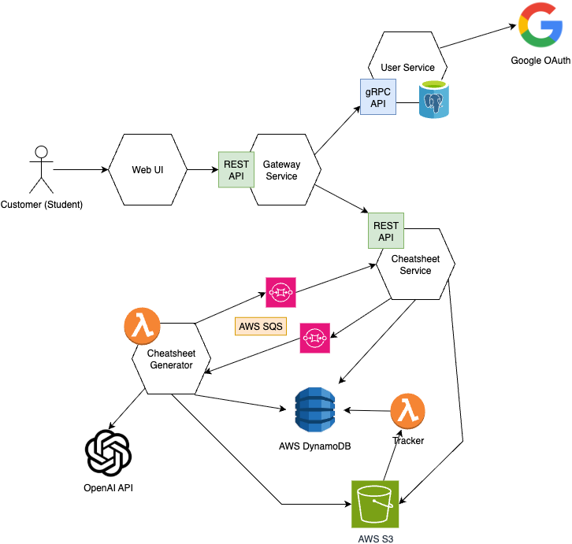

# openexam

## Stack

- gateway (rust): axum, tonic
- user (rust): tonic, postgres
- cheatsheet (go): s3, dynamodb
- generator (python): lambda, openai-api
  - flow: frontend -> s3 -> sqs -> generator -> s3 -> frontend
- frontend (typescript): nextjs, tailwindcss



## Getting Started

### Running all services locally

this will run lastest images of all services

1. Setup AWS infratstructure

```bash
cd terraform
terraform init
terraform apply
terraform output secret_access_key
# this will generate envs: access_key_id, secret_access_key, bucket_name
```

1. pull images used in `docker-compose.yml`

```bash
# note: if you are on apple silicon, you need to pull the amd64 images
# amd64 e.g. x86_64 (force pulling amd64 images on apple silicon)
docker pull --platform=linux/amd64 ghcr.io/bookpanda/openexam-gateway:latest
docker pull --platform=linux/amd64 ghcr.io/bookpanda/openexam-user:latest
docker pull --platform=linux/amd64 ghcr.io/bookpanda/openexam-cheatsheet:latest
```

2. Copy `.env.template` and paste it in the same directory as `.env`. Fill in the appropriate values. `AWS_ACCESS_KEY_ID`, `AWS_SECRET_ACCESS_KEY`, `AWS_REGION`, `S3_BUCKET` are from the terraform output
3. Run `docker compose up` to start the services.

### Running services on the host

- used when you need to make code changes to some services
- you can comment out that service in root `docker-compose.yml` while working (but don't commit it)

1. Copy `.env.template` and paste it in the same directory as `.env` for that service. Fill in the appropriate values.
2. Follow the instructions in the service's README.md to run the service.

### Deploying Lambda changes

```bash
source .env.terraform && ./deploy_lambdas.sh
```

## API

When run locally, the gateway url will be available at `localhost:3001`.

- Swagger UI: `http://127.0.0.1:3001/swagger/`

## Load Test

- docker run --rm -i -v "$(pwd)/loadtest:/scripts" -w /scripts grafana/k6:0.50.0 run upload_presign.js
- docker run --rm -i -v "$(pwd)/loadtest:/scripts" -w /scripts grafana/k6:0.50.0 run get_all_files.js
- docker run --rm -i -v "$(pwd)/loadtest:/scripts" -w /scripts grafana/k6:0.50.0 run generate.js
